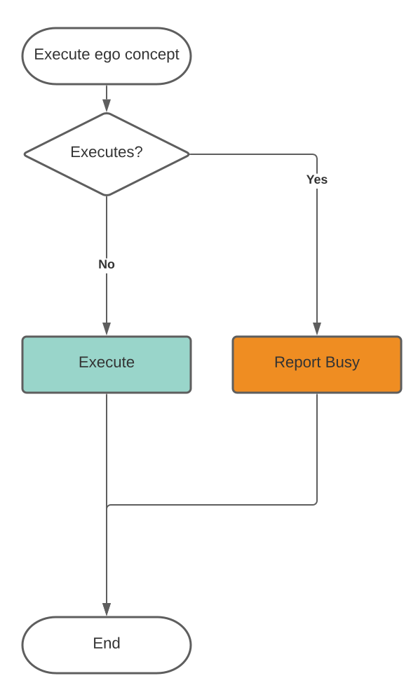
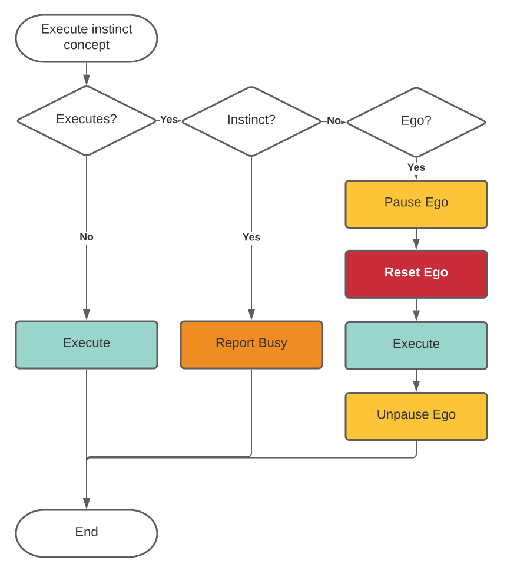
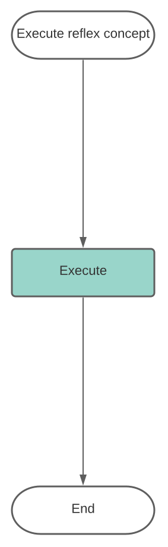

# AliveOS Middle Layer ROS Package

This package contains the middle layer of the OS. This layer is not used by the user directly. The user will interact with the middle layer using application nodes and device nodes.

The middle layer consists of:

- Concept-to-Command Interpreter
- Data-to-Concept Interpreter
- Emotion Core

**Concept-to-Command Interpreter** interprets command concepts received from the application layer to commands for the hardware. Interpretation is based on the JSON descriptors provided by nodes of the application layer. Also, this node manages the interaction between instincts and ego.

**Data-to-Concept Interpreter** interprets data from device nodes to perception concepts that are transferred then to the application layer. Interpretation is based on the JSON descriptors provided by device nodes.

**Emotion Core** is a node that converts data from devices and nodes of the application layer to a set of parameters - hormones. Those parameters are transferred then to the application layer and to the Data-to-Concept Interpreter to affect the device behavior. Interpretation is based on the JSON descriptors provided by device nodes.

This part is used to implement the device's **mood**. Under the affection of many small negative/positive factors, the device can integrate into a summarised state that is the same as a mood in the animal world.

## Concept-to-Command Interpreter interpretation rules

To manage the interaction between application nodes the logics below are applied. Execute == interpret.

---

## 

This repository is part of the [AliveOS](https://github.com/an-dr/aliveos) project.
